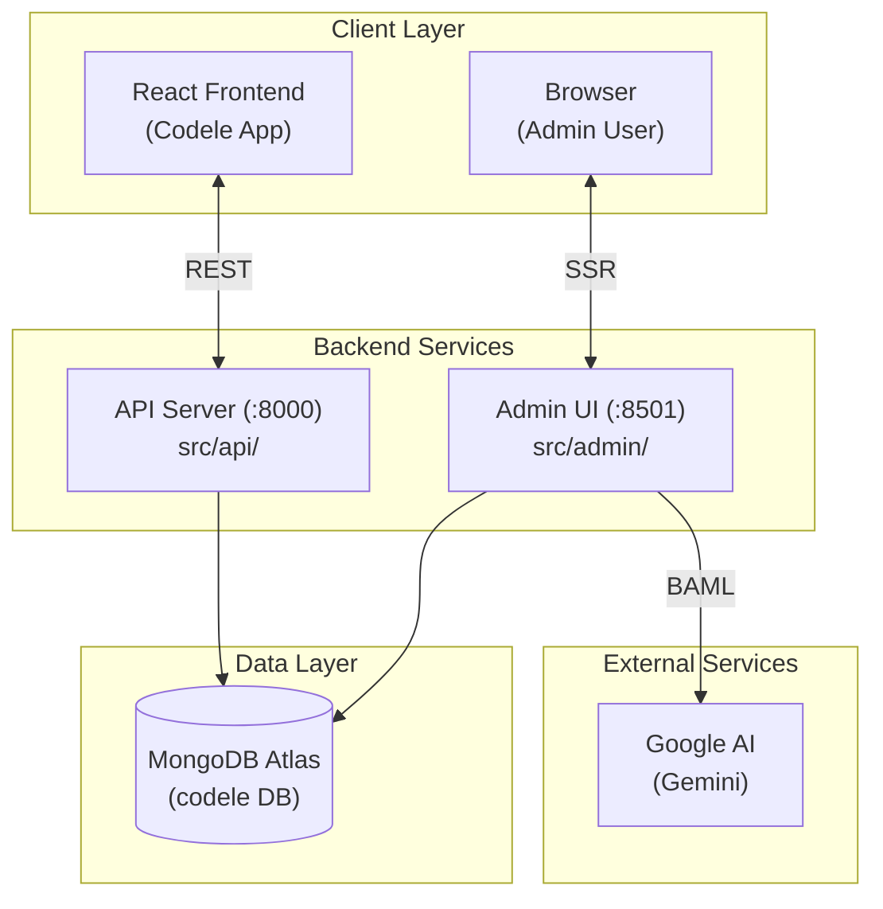

# Codele Backend

**Backend for the Codele daily coding game** — a FastAPI-powered platform that serves daily coding challenges to players and provides an Admin Dashboard for content management and AI-powered problem generation.

The project is split into two independent FastAPI applications that share a common data layer:

| Component | Port | Purpose |
|-----------|------|---------|
| **API Server** (`src/api`) | `8000` | Public-facing REST API consumed by the React frontend |
| **Admin UI** (`src/admin`) | `8501` | Server-side rendered dashboard for content management |

---

## Table of Contents

- [Architecture Overview](#architecture-overview)
- [Tech Stack](#tech-stack)
- [Prerequisites](#prerequisites)
- [Installation](#installation)
- [Configuration](#configuration)
- [Running the Servers](#running-the-servers)
- [API Server](#api-server)
  - [Endpoints](#api-endpoints)
  - [Features](#api-features)
- [Admin UI](#admin-ui)
  - [Pages](#admin-pages)
  - [Features](#admin-features)
- [Data Models](#data-models)
- [Content Engine](#content-engine)
- [Project Structure](#project-structure)

---

## Architecture Overview



Both servers share a common layer under `src/shared/` which contains the database connection logic, Beanie document models, configuration loader, and the content engine service.

---

## Tech Stack

| Layer | Technology |
|-------|-----------|
| Web Framework | [FastAPI](https://fastapi.tiangolo.com/) |
| ASGI Server | [Uvicorn](https://www.uvicorn.org/) |
| Database | [MongoDB Atlas](https://www.mongodb.com/atlas) |
| ODM (async) | [Motor](https://motor.readthedocs.io/) + [Beanie](https://beanie-odm.dev/) |
| AI Integration | [BAML](https://docs.boundaryml.com/) + Google Gemini |
| Templating (Admin) | [Jinja2](https://jinja.palletsprojects.com/) |
| Data Validation | [Pydantic v2](https://docs.pydantic.dev/) |
| Configuration | YAML (`config.yaml`) + `.env` |

---

## Prerequisites

- **Python 3.11+**
- **MongoDB Atlas** account (or a local MongoDB instance)
- **Google AI API key** (for Gemini — used by the content engine)
- **BAML CLI** (`pip install baml-py`) — required to regenerate the AI client if you modify `.baml` files

---

## Installation

1. **Clone the repository:**

   ```bash
   git clone <repository-url>
   cd codele-backend
   ```

2. **Create and activate a virtual environment:**

   ```bash
   python -m venv .venv
   source .venv/bin/activate   # Linux/macOS
   # .venv\Scripts\activate    # Windows
   ```

3. **Install dependencies:**

   ```bash
   pip install -r requirements.txt
   ```

4. **Set up environment variables:**

   ```bash
   cp .env.example .env
   ```

   Then edit `.env` with your actual credentials:

   ```env
   # MongoDB Atlas connection string
   MONGODB_URI=mongodb+srv://<user>:<password>@<cluster>.mongodb.net/codele?retryWrites=true&w=majority

   # Google AI API key for Gemini (used by BAML)
   GOOGLE_API_KEY=your-google-api-key-here
   ```

5. **(Optional) Regenerate the BAML client** — only needed if you modify files in `src/admin/baml_src/`:

   ```bash
   cd src/admin/baml_src
   baml-cli generate
   cd ../../..
   ```

---

## Configuration

Application configuration is managed through `config.yaml` in the project root:

```yaml
project:
  name: "Codele API"
  description: "Backend for the Codele daily coding game."
  version: "0.1.0"

server:
  host: "0.0.0.0"
  port: 8000

cors:
  allowed_origins:
    - "https://codele.watsonml.dev"
    - "http://localhost:3000"
    - "http://localhost:5173"

logging:
  level: "INFO"
  format: "%(asctime)s | %(levelname)-8s | %(name)s | %(message)s"
```

The config is loaded once at startup and cached via `src/shared/config.py`.

---

## Running the Servers

### API Server (port 8000)

```bash
uvicorn src.api.main:app --host 0.0.0.0 --port 8000 --reload
```

- Swagger docs: [http://localhost:8000/docs](http://localhost:8000/docs)
- ReDoc: [http://localhost:8000/redoc](http://localhost:8000/redoc)

### Admin UI (port 8501)

```bash
uvicorn src.admin.main:app --port 8501 --reload
```

- Dashboard: [http://localhost:8501](http://localhost:8501)

### Run Both Simultaneously

Open two terminal sessions, or use a process manager:

```bash
# Terminal 1 — API
uvicorn src.api.main:app --port 8000 --reload

# Terminal 2 — Admin
uvicorn src.admin.main:app --port 8501 --reload
```

---

## API Server

The public REST API serves the React frontend at `codele.watsonml.dev`. It follows a **tiered access model** to prevent data leakage:

- **Tier 1 (Calendar):** Lightweight metadata only — dates, titles, and difficulty. No problem content.
- **Tier 2 (Problems):** Full problem content — description, starter code, test cases. Time-locked to prevent future access.

### API Endpoints

#### Health Check

| Method | Path | Description |
|--------|------|-------------|
| `GET` | `/health` | Simple liveness probe. Returns `{"status": "ok"}` |

#### Problems (`/api/v1/problem`)

| Method | Path | Description |
|--------|------|-------------|
| `GET` | `/api/v1/problem/today` | Returns today's coding problem with full content |
| `GET` | `/api/v1/problem/{date}` | Returns a specific problem by date (`YYYY-MM-DD`). **Time-locked** — future dates return `403` |

**Example Response:**

```json
{
  "id": "2026-02-15",
  "title": "Two Sum Target",
  "difficulty": "Easy",
  "description": "Given an array of integers...",
  "starterCode": "def solution(nums, target):\n    pass",
  "testCases": [
    {
      "id": 1,
      "type": "basic",
      "hint": "Try using a hash map",
      "input": "[[2,7,11,15], 9]",
      "expected": "[0, 1]"
    }
  ],
  "topics": ["Hash Map", "Two Pointers"]
}
```

#### Calendar (`/api/v1/calendar`)

| Method | Path | Description |
|--------|------|-------------|
| `GET` | `/api/v1/calendar?month=YYYY-MM` | Returns a lightweight list of problems for the given month. Future problems are filtered out |

**Example Response:**

```json
{
  "month": "2026-02",
  "count": 15,
  "days": [
    { "date": "2026-02-01", "title": "Array Reversal", "difficulty": "Easy" },
    { "date": "2026-02-02", "title": "Palindrome Check", "difficulty": "Easy" }
  ]
}
```

#### Themes (`/api/v1/themes`)

| Method | Path | Description |
|--------|------|-------------|
| `GET` | `/api/v1/themes` | Returns all past and current themes. Optionally filter by `?month=YYYY-MM`. Future themes are never returned |

### API Features

- **Time-Locking** — Future problems can never be fetched through the API, preventing players from seeing upcoming challenges
- **Adapter Pattern** — MongoDB's `_id` is transparently renamed to `id` and internal fields like `embedding` are stripped before returning responses
- **camelCase Serialization** — Pydantic aliases ensure all API responses use camelCase keys (`starterCode`, `testCases`) for direct React frontend compatibility
- **CORS Configuration** — Configurable allowed origins for both production (`codele.watsonml.dev`) and local development
- **Auto-generated Docs** — FastAPI's built-in Swagger UI and ReDoc are available at `/docs` and `/redoc`

---

## Admin UI

The Admin Dashboard is a **server-side rendered (SSR)** web application built with FastAPI and Jinja2 templates. It provides a full content management interface for creating, editing, scheduling, and AI-generating daily coding problems.

### Admin Pages

#### 1. Calendar Dashboard (`/`)

The home page displays an interactive monthly calendar showing all scheduled problems at a glance.

- **Color-coded cells** — Each day shows the problem status: filled (has a problem) or empty (needs content)
- **Theme visualization** — Active themes are highlighted with colored borders spanning their date ranges, with unique colors per theme
- **Buffer depth indicator** — Shows how many days of content are scheduled beyond today
- **Month navigation** — Navigate between months with previous/next controls
- **Theme sidebar** — Lists recent themes with their date ranges and allows inline renaming
- **Drag-and-drop rescheduling** — Drag problems between calendar dates to reschedule them instantly via AJAX

#### 2. Problem Editor (`/editor/{date}`)

A full-featured editor for creating and modifying individual daily problems.

- **Form fields** — Title, difficulty (Easy/Medium/Hard), description (Markdown), starter code, and comma-separated topic tags
- **Test case manager** — Add, edit, and remove test cases with fields for type (`basic`, `edge`, `logic`, `conciseness`), input, expected output, and hint
- **JSON test case parsing** — Test cases are stored as structured JSON, with a dynamic form UI for editing
- **Save, Delete, Move** — Save edits, delete a problem entirely, or move it to a different date
- **Date collision detection** — Moving a problem to a date that already has content is blocked with a `409 Conflict` error

#### 3. Content Generation (`/generate`)

The AI-powered batch generation interface for creating multiple problems at once.

- **Batch planning** — Define one or more batches, each with a start date, problem count, and optional theme
- **Auto-theme selection** — If no theme is specified, the AI automatically picks a unique theme while avoiding recent repeats
- **Multi-batch execution** — Submit multiple batches in sequence; each batch sees previously generated themes to prevent duplicates
- **Live generation feedback** — Results are displayed after each batch completes, showing the theme chosen, problems created, and date range
- **Buffer depth tracking** — The UI shows the current content buffer and the next available open date
- **Negative RAG deduplication** — All existing problem titles are passed to the AI as a blocklist to prevent duplicate problems

### Admin Features

- **No Authentication Required** — The Admin UI is designed for trusted local/internal use (runs on a separate port)
- **SSR with Jinja2** — All pages are server-rendered HTML with progressive enhancement via vanilla JavaScript
- **Static Assets** — Custom CSS (`style.css`) and JavaScript files (`calendar.js`, `editor.js`, `generate.js`) for interactivity
- **AJAX Endpoints** — JSON API endpoints within the admin app (`/api/move`, `/api/generate`, `/api/theme/update`) for dynamic operations without full page reloads
- **Theme Management** — Create, rename, and visualize themes directly from the calendar dashboard

---

## Data Models

All data is stored in MongoDB and managed through [Beanie](https://beanie-odm.dev/) ODM documents defined in `src/shared/models/problem.py`.

### `DailyProblem`

Stored in the `daily_problems` collection. The document ID is the date string (`YYYY-MM-DD`).

| Field | Type | Alias | Description |
|-------|------|-------|-------------|
| `id` | `str` | `_id` | Date key, e.g. `"2026-02-15"` |
| `title` | `str` | — | Human-readable problem title |
| `difficulty` | `str` | — | `"Easy"`, `"Medium"`, or `"Hard"` |
| `description` | `str` | — | Full problem statement in Markdown |
| `starter_code` | `str` | `starterCode` | Python boilerplate given to the player |
| `test_cases` | `List[TestCase]` | `testCases` | Exactly 6 test cases |
| `topics` | `List[str]` | — | Tags like `"Dynamic Programming"` |
| `embedding` | `List[float]` | — | Optional vector embedding (internal) |

### `TestCase`

Embedded subdocument within `DailyProblem`.

| Field | Type | Alias | Description |
|-------|------|-------|-------------|
| `id` | `int` | — | Sequential ID (1–6) |
| `type` | `str` | — | `"basic"`, `"edge"`, `"logic"`, or `"conciseness"` |
| `hint` | `str` | — | Tooltip hint shown on failure |
| `input` | `str` | — | Input arguments as JSON string |
| `expected_output` | `str` | `expected` | Expected return value as JSON string |

### `WeeklyTheme`

Stored in the `weekly_themes` collection. Tracks the theme chosen for each generated batch of problems.

| Field | Type | Description |
|-------|------|-------------|
| `id` | `ObjectId` | Auto-generated MongoDB ID |
| `theme` | `str` | Theme name (e.g. `"Sliding Window"`) |
| `start_date` | `str` | First date in the batch (`YYYY-MM-DD`) |
| `end_date` | `str` | Last date in the batch (`YYYY-MM-DD`) |
| `count` | `int` | Number of problems in the batch |
| `week_id` | `str` | Legacy ISO week key (e.g. `"2026-W07"`) |
| `generated_at` | `datetime` | Timestamp of batch generation |

---

## Content Engine

The content engine (`src/shared/services/content_engine.py`) orchestrates AI-powered problem generation using [BAML](https://docs.boundaryml.com/) and Google Gemini.

### Generation Pipeline

```
1. Find next open date  →  Scans DB for the latest scheduled problem, appends after it
2. Pick theme           →  AI selects a unique theme, avoiding the 10 most recent themes
3. Fetch existing titles →  All titles loaded as a blocklist (Negative RAG)
4. Generate via BAML    →  Gemini produces N problem schemas matching strict formatting rules
5. Build documents      →  Schemas are enriched with dates and difficulty progression
6. Bulk insert          →  Problems are batch-inserted into MongoDB
7. Save theme record    →  A WeeklyTheme document is persisted for tracking
```

### Difficulty Progression

Problems follow a repeating 7-day cycle:

| Day | Difficulty |
|-----|-----------|
| 1 (Mon) | Easy |
| 2 (Tue) | Easy |
| 3 (Wed) | Medium |
| 4 (Thu) | Medium |
| 5 (Fri) | Hard |
| 6 (Sat) | Hard |
| 7 (Sun) | Medium |

For batches longer than 7, the cycle repeats.

### BAML Definition

The AI prompts and schemas are defined in `.baml` files under `src/admin/baml_src/`:

- **`clients.baml`** — Configures the Gemini Flash client with temperature `0.7` and max output of 8192 tokens
- **`generators.baml`** — Defines two AI functions:
  - `PickWeeklyTheme` — Selects a creative theme avoiding recent repeats
  - `GenerateProblemBatch` — Generates N complete problems with descriptions, starter code, test cases, and topic tags

---

## Project Structure

```
codele-backend/
├── config.yaml              # Application configuration (CORS, server, logging)
├── requirements.txt         # Python dependencies
├── .env                     # Environment variables (git-ignored)
├── .env.example             # Template for .env
│
└── src/
    ├── api/                 # ── Public REST API Server ──
    │   ├── main.py          # FastAPI app entrypoint (port 8000)
    │   ├── routers/
    │   │   ├── problems.py  # /api/v1/problem — full problem content (Tier 2)
    │   │   ├── calendar.py  # /api/v1/calendar — lightweight month view (Tier 1)
    │   │   └── themes.py    # /api/v1/themes — weekly theme listing
    │   └── middleware/      # (Reserved for rate limiting, etc.)
    │
    ├── admin/               # ── Admin Dashboard (SSR) ──
    │   ├── main.py          # FastAPI app entrypoint (port 8501)
    │   ├── templates/       # Jinja2 HTML templates
    │   │   ├── base.html    # Base layout template
    │   │   ├── calendar.html    # Calendar dashboard page
    │   │   ├── editor.html      # Problem editor page
    │   │   └── generate.html    # AI generation page
    │   ├── static/          # Frontend assets
    │   │   ├── style.css    # Dashboard styles
    │   │   ├── calendar.js  # Calendar interactivity (drag-and-drop)
    │   │   ├── editor.js    # Editor form logic
    │   │   └── generate.js  # Generation UI logic
    │   ├── baml_src/        # BAML AI definitions (source of truth)
    │   │   ├── clients.baml     # Gemini client configuration
    │   │   └── generators.baml  # AI function prompts & schemas
    │   └── baml_client/     # Auto-generated BAML Python client (git-ignored)
    │
    └── shared/              # ── Shared Layer ──
        ├── config.py        # YAML config loader (cached)
        ├── db.py            # Motor + Beanie initialization
        ├── models/
        │   └── problem.py   # DailyProblem, TestCase, WeeklyTheme documents
        └── services/
            └── content_engine.py  # AI generation pipeline
```

---

## License

This project is proprietary. All rights reserved.
